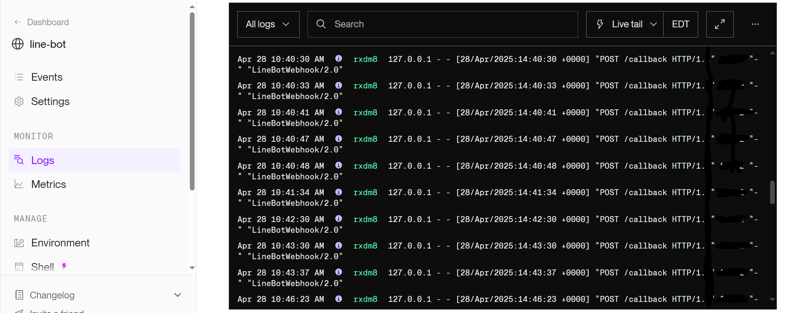
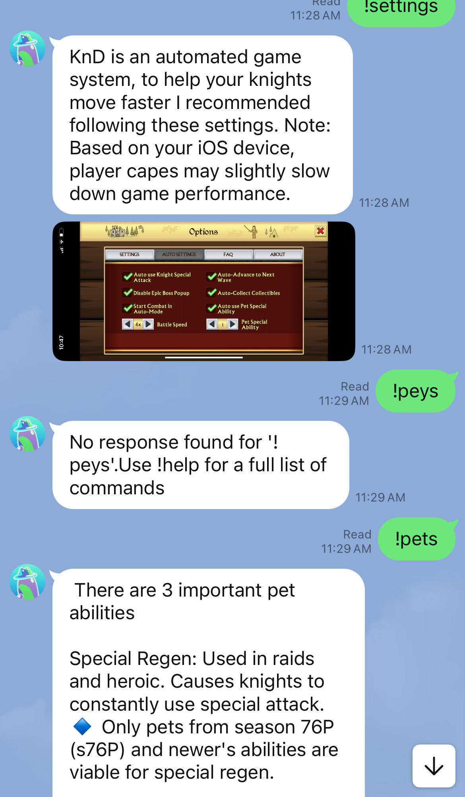

## Automated Response ChatBot

### The Purpose

 This chatbot is purely for entertainment purposes, it is not a product. The bot is designed to help assist new and current players
 in the mobile game knights and dragons. As a leader in my game community, I noticed that many new players had similar questions. 
 The bot contains answers for these questions, in response to a keyword led by an !. For example, if you had a question about the games
 chest system, you'd type !chests. A !help command is avaliable to display the list of commands. 

</n>

### Creation

 The bot is created entirely through Python, utilizing packages such as linebot, os, dotenv and flask in deployment/development processes. </n>

 Images and videos were uploaded to a free site, imgur, in order to be called by the bot. 

* Link to .py file: [python_bot](line_pybot.py)

</n>

### Deployment

 The bot is deployed on the LINE communication app. It is being hosted through the service Render, utilizing github for the necessary files. 
 The bot uses LINE's access tokens to connect to their servers. 

#### Render Live Feed

<b> April 28th logs </b>

#### In Action

